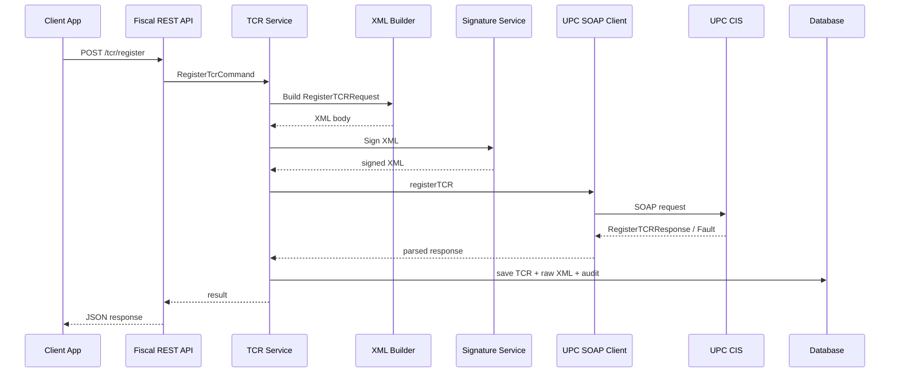
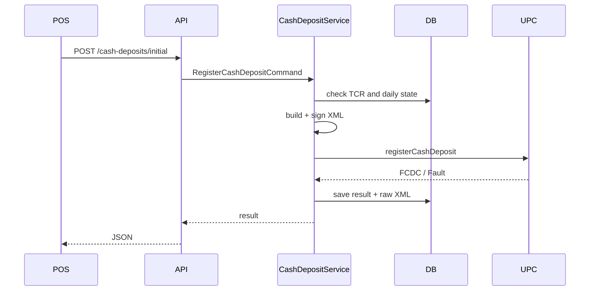
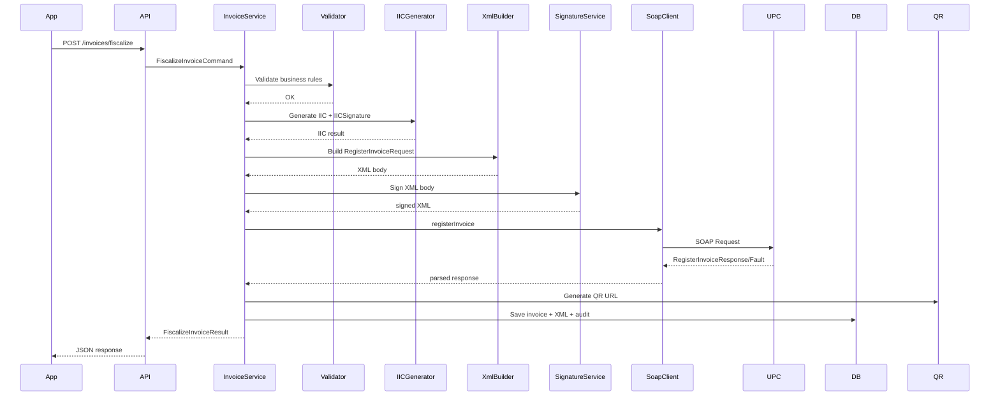

# SUMMA FISCAL ENGINE

**Verzija:** 1.0  
**Status:** arhitektura + implementacioni vodič za C#/.NET servis  
**Platforma:** Summa Fiscal Platform / Fiscal Engine  
**Primarna država:** Crna Gora  
**Izvori:**

- `docs/official_pu_v5/Fiskalni_servis_Tehnicka_specifikacija_v5_final.docx`
- `docs/official_pu_v5/Fiskalni_servis_Funkcionalna_specifikacija_v5_final.docx`
- `docs/official_pu_v5/FiscalService_v5_official.wsdl`
- `docs/official_pu_v5/FiscalService_v5_official.xsd`

> Ovaj dokument je glavni implementacioni vodič za razvoj Fiscal Engine modula. Nije samo opis API-ja. Dokument definiše poslovnu arhitekturu, tehničku arhitekturu, module, tokove rada, bazu, klase, interfejse, greške, retry/offline logiku, REST API sloj i C# implementacioni plan.

---

## 0. Važna napomena za Codex / AI agente

Ovaj dokument se mora čitati zajedno sa zvaničnom tehničkom i funkcionalnom specifikacijom v5. U slučaju neslaganja između ovog dokumenta i zvaničnog XSD/WSDL/DOCX dokumenta, **zvanični XSD/WSDL/DOCX imaju prednost**.

Codex ne smije da izmišlja XML tagove, SOAP akcije, namespace-ove, algoritme potpisa ili vrijednosti enumeracija. Sve što se šalje prema UPC mora biti validirano prema zvaničnom XSD-u.

---

## 1. Cilj sistema

Cilj je napraviti **centralni Fiscal Engine** koji omogućava fiskalizaciju računa u Crnoj Gori preko servisa UPC, ali tako da isti engine može koristiti:

- web aplikacija za fakturisanje,
- desktop POS,
- mobilna aplikacija,
- računovodstveni program,
- ERP sistem,
- integracije sa trećim stranama,
- budući moduli Summa platforme.

Fiscal Engine ne smije biti samo “SOAP wrapper”. On mora biti pouzdani servis koji rješava kompletan životni ciklus fiskalizacije:

1. validacija poslovnih pravila,
2. priprema računa,
3. generisanje IKOF/IIC,
4. izrada XML-a,
5. XSD validacija,
6. digitalno potpisivanje,
7. slanje SOAP poruke,
8. obrada odgovora,
9. čuvanje JIKR/FIC,
10. QR kod,
11. retry i offline režim,
12. audit log,
13. integracija sa lokalnom bazom,
14. REST API za aplikacije.

---

## 2. Osnovni pojmovi

| Lokalni naziv | Engleski/XML naziv | Značenje u sistemu |
|---|---|---|
| UPC | UPC | Uprava prihoda i carina |
| CIS | CIS | Centralni informacioni sistem EFI |
| SEP | SEP/SCP | Samouslužni EFI portal |
| ENU | TCR | Elektronski naplatni uređaj |
| Kod ENU | TCRCode | Kod koji vraća CIS nakon registracije ENU |
| IKOF | IIC | Identifikacioni kod obveznika fiskalizacije |
| JIKR | FIC | Jedinstveni identifikacioni kod računa koji vraća UPC |
| PIB/JMB | IssuerTIN | Poreski identifikacioni broj izdavaoca |
| Poslovni prostor | BusinUnitCode | Kod poslovne jedinice/prostora |
| Softverski kod | SoftCode | Kod softvera koji se koristi |
| Operater | OperatorCode | Kod operatera koji izdaje račun |

---

## 3. Zvanični servis UPC

### 3.1. Okruženja

Fiscal Engine mora podržati dva okruženja:

```text
TEST:
https://efitest.tax.gov.me/fs-v1

PRODUCTION:
https://efi.tax.gov.me/fs-v1
```

QR kod koristi:

```text
TEST QR:
https://efitest.tax.gov.me/ic/#/verify

PRODUCTION QR:
https://mapr.tax.gov.me/ic/#/verify
```

### 3.2. SOAP operacije

Prema WSDL-u, osnovne operacije su:

```text
registerInvoice
registerTCR
registerCashDeposit
```

Mapiranje:

| Operacija | Request XML | Response XML | SOAP Action |
|---|---|---|---|
| Registracija računa | RegisterInvoiceRequest | RegisterInvoiceResponse | https://efi.tax.gov.me/fs/RegisterInvoice |
| Registracija ENU | RegisterTCRRequest | RegisterTCRResponse | https://efi.tax.gov.me/fs/RegisterTCR |
| Registracija gotovinskog depozita | RegisterCashDepositRequest | RegisterCashDepositResponse | https://efi.tax.gov.me/fs/RegisterCashDeposit |

### 3.3. Namespace

```xml
https://efi.tax.gov.me/fs/schema
```

XML digital signature namespace:

```xml
http://www.w3.org/2000/09/xmldsig#
```

SOAP envelope:

```xml
http://schemas.xmlsoap.org/soap/envelope/
```

---

## 4. Visoka arhitektura sistema

```text
┌───────────────────────────────────────────────────────────────┐
│                         Client Apps                           │
│ Web App │ Desktop POS │ Mobile App │ Accounting │ ERP │ API   │
└───────────────────────────────┬───────────────────────────────┘
                                │ REST/HTTPS
┌───────────────────────────────▼───────────────────────────────┐
│                      Summa Fiscal API                          │
│ Authentication │ Tenant │ Rate Limit │ Validation │ Audit      │
└───────────────────────────────┬───────────────────────────────┘
                                │ Commands/Queries
┌───────────────────────────────▼───────────────────────────────┐
│                       Fiscal Engine Core                       │
│ Invoice Engine │ TCR Engine │ Deposit Engine │ QR │ Offline    │
└───────────────────────────────┬───────────────────────────────┘
                                │
┌───────────────────────────────▼───────────────────────────────┐
│                     Technical Integration Layer                │
│ IKOF │ XML Builder │ XSD Validator │ Signer │ SOAP Client      │
└───────────────────────────────┬───────────────────────────────┘
                                │ SOAP/HTTPS
┌───────────────────────────────▼───────────────────────────────┐
│                         UPC Fiscal Service                     │
│ registerInvoice │ registerTCR │ registerCashDeposit            │
└───────────────────────────────────────────────────────────────┘
```

### 4.1. Glavno pravilo dizajna

Sve aplikacije koriste **naš REST API**, nikada direktno UPC SOAP servis.

Razlog:

- UPC SOAP detalji ostaju izolovani,
- XML, potpis i XSD validacija su centralizovani,
- aplikacije rade sa čistim JSON modelima,
- retry/offline/audit je jedinstven,
- kasnije se lakše dodaju desktop, mobilna i web aplikacija.

---

## 5. Predložena .NET solution struktura

```text
src/
  Summa.Fiscal.Api/
  Summa.Fiscal.Application/
  Summa.Fiscal.Domain/
  Summa.Fiscal.Infrastructure/
  Summa.Fiscal.Worker/
  Summa.Fiscal.Contracts/
  Summa.Fiscal.Soap/
  Summa.Fiscal.Xml/
  Summa.Fiscal.Security/
  Summa.Fiscal.Qr/
  Summa.Fiscal.Tests/
```

### 5.1. Projekti

| Projekat | Svrha |
|---|---|
| `Summa.Fiscal.Api` | REST API za web/desktop/mobile/ERP |
| `Summa.Fiscal.Application` | Use-case logika, command/query handleri |
| `Summa.Fiscal.Domain` | Entiteti, value objekti, poslovna pravila |
| `Summa.Fiscal.Infrastructure` | PostgreSQL, fajl sistem, queue, external clients |
| `Summa.Fiscal.Worker` | retry, offline sync, background jobovi |
| `Summa.Fiscal.Contracts` | DTO modeli za javni REST API |
| `Summa.Fiscal.Soap` | SOAP transport prema UPC |
| `Summa.Fiscal.Xml` | XML builder, serializer, XSD validator |
| `Summa.Fiscal.Security` | certifikati, digitalni potpis, IKOF potpis |
| `Summa.Fiscal.Qr` | QR URL i QR image generator |
| `Summa.Fiscal.Tests` | unit/integration/e2e testovi |

---

## 6. Core moduli

Fiscal Engine se dijeli na ove module:

```text
Fiscal Engine
├── Company & Tenant Module
├── Certificate Module
├── Business Unit Module
├── TCR / ENU Module
├── Software Registration Module
├── Cash Deposit Module
├── Invoice Module
├── Invoice Type Module
├── IKOF/IIC Generator
├── XML Builder
├── XML Validator
├── Digital Signature Module
├── SOAP Client Module
├── Response Parser
├── QR Module
├── Offline Module
├── Retry Queue
├── Error Handling Module
├── Audit Log Module
├── Sync Module
├── REST API Module
├── Desktop Service Adapter
├── Web App Adapter
└── Mobile App Adapter
```

---

## 7. Modul: registracija ENU / TCR

### 7.1. Poslovna svrha

Svaki ENU koji izdaje gotovinske ili bezgotovinske račune mora biti registrovan kod UPC prije fiskalizacije računa. Rezultat registracije je `TCRCode`, koji se koristi kod fiskalizacije računa i kod registracije gotovinskog depozita.

### 7.2. Zvanični XML

Request:

```xml
RegisterTCRRequest
  @Id="Request"
  @Version="1"
  Header
    @UUID
    @SendDateTime
  TCR
    @IssuerTIN
    @BusinUnitCode
    @TCRIntID / @TCRIntId
    @SoftCode
    @MaintainerCode
    @ValidFrom
    @ValidTo
    @Type
  Signature
```

Response:

```xml
RegisterTCRResponse
  @Id="Response"
  @Version="1"
  Header
    @UUID
    @RequestUUID
    @SendDateTime
  TCRCode
  Signature
```

> Napomena: u dokumentaciji se pojavljuju varijante `TCRIntId` i primjer sa `TCRIntID`. Kod implementacije koristiti naziv definisan u zvaničnom XSD-u. Ako XSD kaže `TCRIntID`, C# XML atribut mora biti upravo `TCRIntID`.

### 7.3. REST endpoint

```http
POST /api/fiscal/tcr/register
```

Request JSON:

```json
{
  "companyId": "uuid",
  "issuerTin": "02657597",
  "businessUnitCode": "ab123ab123",
  "internalTcrId": "1",
  "softCode": "ab123ab123",
  "maintainerCode": "mm123mm123",
  "validFrom": "2026-07-03",
  "validTo": null,
  "type": "REGULAR"
}
```

Response JSON:

```json
{
  "success": true,
  "tcrCode": "ab123ab123",
  "requestUuid": "...",
  "responseUuid": "...",
  "sendDateTime": "...",
  "rawRequestXmlId": "...",
  "rawResponseXmlId": "..."
}
```

### 7.4. Klase

```csharp
public sealed class RegisterTcrCommand
{
    public Guid CompanyId { get; init; }
    public string IssuerTin { get; init; } = default!;
    public string BusinessUnitCode { get; init; } = default!;
    public string InternalTcrId { get; init; } = default!;
    public string SoftCode { get; init; } = default!;
    public string MaintainerCode { get; init; } = default!;
    public DateOnly? ValidFrom { get; init; }
    public DateOnly? ValidTo { get; init; }
    public TcrType Type { get; init; }
}
```

```csharp
public enum TcrType
{
    REGULAR,
    VENDING
}
```

```csharp
public interface ITcrRegistrationService
{
    Task<RegisterTcrResult> RegisterAsync(RegisterTcrCommand command, CancellationToken ct);
}
```

```csharp
public interface ITcrXmlBuilder
{
    XmlDocument BuildRegisterTcrRequest(RegisterTcrCommand command, FiscalMessageHeader header);
}
```

```csharp
public interface IFiscalSoapClient
{
    Task<FiscalSoapResponse> RegisterTcrAsync(string signedSoapEnvelope, CancellationToken ct);
}
```

### 7.5. Workflow

```text
Client
  ↓
POST /api/fiscal/tcr/register
  ↓
Validate command
  ↓
Load company certificate
  ↓
Build RegisterTCRRequest XML body
  ↓
Sign XML body
  ↓
Wrap in SOAP envelope
  ↓
Send SOAP registerTCR
  ↓
Parse RegisterTCRResponse or SOAP Fault
  ↓
Save TCRCode / error
  ↓
Audit everything
  ↓
Return REST response
```

### 7.6. Sequence diagram



### 7.7. Greške

| Greška | Ponašanje sistema |
|---|---|
| XSD greška prije slanja | ne šalji UPC; vrati `ValidationFailed` |
| Certifikat nedostaje | ne šalji UPC; vrati `CertificateMissing` |
| SOAP Fault od UPC | sačuvaj raw fault, mapiraj grešku |
| Timeout | status `PendingRetry`, ali samo ako je bezbjedno ponoviti isti request |
| TCR već registrovan | sačuvaj postojeći/novi odgovor u skladu sa UPC logikom |

---

## 8. Modul: registracija softvera

### 8.1. Svrha

Fiscal Engine ne registruje softver direktno posebnom SOAP operacijom u ovom WSDL-u; softverski kod `SoftCode` i kod održavaoca `MaintainerCode` koriste se u registraciji ENU i u fiskalizaciji računa. Zato aplikacija mora imati internu evidenciju softvera i održavaoca.

### 8.2. Entiteti

```csharp
public sealed class FiscalSoftware
{
    public Guid Id { get; set; }
    public string SoftCode { get; set; } = default!;
    public string Name { get; set; } = default!;
    public string Version { get; set; } = default!;
    public string MaintainerCode { get; set; } = default!;
    public bool IsActive { get; set; }
}
```

### 8.3. Pravila

- `SoftCode` je obavezan kod registracije ENU.
- `SoftCode` je obavezan kod fiskalizacije računa.
- `MaintainerCode` je obavezan kod nove registracije ENU.
- Sistem ne smije dozvoliti izdavanje računa bez aktivnog `SoftCode`.

### 8.4. REST endpointi

```http
POST /api/fiscal/software
GET  /api/fiscal/software
GET  /api/fiscal/software/{id}
PATCH /api/fiscal/software/{id}
```

---

## 9. Modul: registracija gotovinskog depozita

### 9.1. Poslovna svrha

Za ENU koji izdaje gotovinske račune mora se na početku svakog poslovnog dana registrovati početni gotovinski depozit (`INITIAL`) prije izdavanja prvog gotovinskog računa. Tokom dana se evidentira podizanje gotovine (`WITHDRAW`). Depozit može biti `0.00`.

### 9.2. Zvanični XML

Request:

```xml
RegisterCashDepositRequest
  @Id="Request"
  @Version="1"
  Header
    @UUID
    @SendDateTime
    @SubseqDelivType optional
  CashDeposit
    @ChangeDateTime
    @Operation
    @CashAmt
    @TCRCode
    @IssuerTIN
  Signature
```

Response:

```xml
RegisterCashDepositResponse
  @Id="Response"
  @Version="1"
  Header
    @UUID
    @RequestUUID
    @SendDateTime
  FCDC
  Signature
```

### 9.3. Enumeracije

```csharp
public enum CashDepositOperation
{
    INITIAL,
    WITHDRAW
}
```

```csharp
public enum SubsequentDeliveryType
{
    NOINTERNET,
    BOUNDBOOK,
    SERVICE,
    TECHNICALERROR,
    BUSINESSNEED
}
```

### 9.4. REST endpointi

```http
POST /api/fiscal/cash-deposits/initial
POST /api/fiscal/cash-deposits/withdraw
GET  /api/fiscal/cash-deposits/today?tcrCode=...
```

### 9.5. Klase

```csharp
public sealed class RegisterCashDepositCommand
{
    public Guid CompanyId { get; init; }
    public string IssuerTin { get; init; } = default!;
    public string TcrCode { get; init; } = default!;
    public CashDepositOperation Operation { get; init; }
    public decimal CashAmount { get; init; }
    public DateTimeOffset ChangeDateTime { get; init; }
    public SubsequentDeliveryType? SubseqDelivType { get; init; }
}
```

```csharp
public interface ICashDepositService
{
    Task<RegisterCashDepositResult> RegisterInitialAsync(RegisterCashDepositCommand command, CancellationToken ct);
    Task<RegisterCashDepositResult> RegisterWithdrawAsync(RegisterCashDepositCommand command, CancellationToken ct);
}
```

### 9.6. Poslovna pravila

- `INITIAL` je obavezan za gotovinski ENU prije prvog gotovinskog računa.
- `INITIAL` se registruje jednom dnevno, ali se može mijenjati dok nije fiskalizovan prvi račun tog dana.
- `WITHDRAW` ne smije biti `0.00`.
- Ako je poslovni prostor isključivo za bezgotovinske račune, depozit nije obavezan.
- Za lokale 0-24 početni depozit se registruje poslije 00:00.

### 9.7. Workflow

```text
CashDepositCommand
  ↓
Validate TCR exists and is active
  ↓
Check daily deposit state
  ↓
Build RegisterCashDepositRequest
  ↓
Sign request
  ↓
Send registerCashDeposit
  ↓
Parse FCDC or Fault
  ↓
Save deposit record
  ↓
Update daily cash state
```

### 9.8. Sequence diagram



---

## 10. Modul: fiskalizacija računa

### 10.1. Svrha

Ovo je centralni modul sistema. Prima interni JSON račun, validira poslovna pravila, generiše IKOF, pravi XML `RegisterInvoiceRequest`, potpisuje poruku, šalje je UPC i čuva JIKR/FIC.

### 10.2. Zvanični XML root

```xml
RegisterInvoiceRequest
  @Id="Request"
  @Version="1"
  Header
  Invoice
  Signature
```

Response:

```xml
RegisterInvoiceResponse
  @Id="Response"
  @Version="1"
  Header
  FIC
  Signature
```

### 10.3. Najvažniji atributi Invoice elementa

```xml
Invoice
  @InvType
  @TypeOfInv
  @TypeOfSelfiss
  @IsSimplifiedInv
  @IssueDateTime
  @InvNum
  @InvOrdNum
  @TCRCode
  @IsIssuerInVAT
  @TaxFreeAmt
  @MarkupAmt
  @GoodsExAmt
  @TotPriceWoVAT
  @TotVATAmt
  @TotPrice
  @TotPriceToPay
  @OperatorCode
  @BusinUnitCode
  @SoftCode
  @IIC
  @IICSignature
  @IsReverseCharge
  @PayDeadline
  @BankAccNum
  @Note
  @ParagonBlockNum
  @TaxPeriod
```

Elementi:

```xml
CorrectiveInv
IICRefs
SupplyDateOrPeriod
PayMethods
Currency
Seller
Buyer
Items
SameTaxes
Approvals
Fees
BadDebtInv
```

### 10.4. Tipovi računa

```csharp
public enum FiscalInvoiceType
{
    INVOICE,
    CORRECTIVE,
    SUMMARY,
    PERIODICAL,
    ADVANCE,
    CREDIT_NOTE
}
```

### 10.5. Vrste računa

```csharp
public enum TypeOfInvoice
{
    CASH,
    NONCASH
}
```

### 10.6. Načini plaćanja

```csharp
public enum PaymentMethodType
{
    BANKNOTE,
    CARD,
    BUSINESSCARD,
    SVOUCHER,
    COMPANY,
    ORDER,
    ADVANCE,
    ACCOUNT,
    FACTORING,
    OTHER,
    OTHER_CASH
}
```

> U XML-u se vrijednost za `OTHER-CASH` šalje sa crticom. C# enum može koristiti `OTHER_CASH`, ali XML serializer mora mapirati vrijednost na `OTHER-CASH`.

### 10.7. REST endpoint

```http
POST /api/fiscal/invoices/fiscalize
```

Request JSON:

```json
{
  "companyId": "uuid",
  "invoiceType": "INVOICE",
  "typeOfInvoice": "CASH",
  "issueDateTime": "2026-07-03T12:30:00+02:00",
  "invoiceNumber": "pp123pp123/1/2026/ab123ab123",
  "invoiceOrdinalNumber": 1,
  "tcrCode": "ab123ab123",
  "businessUnitCode": "pp123pp123",
  "softCode": "ss123ss123",
  "operatorCode": "op123op123",
  "isIssuerInVat": true,
  "totPriceWithoutVat": 16.00,
  "totVatAmount": 4.00,
  "totPrice": 20.00,
  "payments": [
    { "type": "BANKNOTE", "amount": 20.00 }
  ],
  "seller": {
    "idType": "TIN",
    "idNumber": "02657597",
    "name": "Prodavac DOO",
    "address": "Adresa",
    "town": "Bar",
    "country": "MNE"
  },
  "buyer": null,
  "items": [
    {
      "name": "Usluga",
      "code": "001",
      "unit": "kom",
      "quantity": 1,
      "unitPriceBeforeVat": 16.00,
      "unitPriceAfterVat": 20.00,
      "rebate": 0,
      "rebateReducesBase": true,
      "priceBeforeVat": 16.00,
      "vatRate": 25.00,
      "vatAmount": 4.00,
      "priceAfterVat": 20.00
    }
  ]
}
```

Response JSON:

```json
{
  "success": true,
  "invoiceId": "uuid",
  "iic": "4AD5A215BEAF85B0416235736A6DACAB",
  "fic": "a592e7ec-9517-4f02-8d54-ac965f679a8c",
  "qrUrl": "https://mapr.tax.gov.me/ic/#/verify?...",
  "status": "Fiscalized"
}
```

### 10.8. Klase

```csharp
public sealed class FiscalizeInvoiceCommand
{
    public Guid CompanyId { get; init; }
    public FiscalInvoiceType InvoiceType { get; init; }
    public TypeOfInvoice TypeOfInvoice { get; init; }
    public DateTimeOffset IssueDateTime { get; init; }
    public string InvoiceNumber { get; init; } = default!;
    public long InvoiceOrdinalNumber { get; init; }
    public string TcrCode { get; init; } = default!;
    public string BusinessUnitCode { get; init; } = default!;
    public string SoftCode { get; init; } = default!;
    public string OperatorCode { get; init; } = default!;
    public bool IsIssuerInVat { get; init; }
    public decimal TotalPriceWithoutVat { get; init; }
    public decimal? TotalVatAmount { get; init; }
    public decimal TotalPrice { get; init; }
    public decimal? TotalPriceToPay { get; init; }
    public List<FiscalPaymentDto> Payments { get; init; } = new();
    public FiscalPartyDto Seller { get; init; } = default!;
    public FiscalPartyDto? Buyer { get; init; }
    public List<FiscalInvoiceItemDto> Items { get; init; } = new();
    public List<FiscalSameTaxDto> SameTaxes { get; init; } = new();
    public List<FiscalIicReferenceDto> IicReferences { get; init; } = new();
}
```

```csharp
public interface IFiscalInvoiceService
{
    Task<FiscalizeInvoiceResult> FiscalizeAsync(FiscalizeInvoiceCommand command, CancellationToken ct);
}
```

```csharp
public interface IInvoiceBusinessValidator
{
    ValidationResult ValidateBeforeIic(FiscalizeInvoiceCommand command);
    ValidationResult ValidateBeforeSend(SignedFiscalInvoice invoice);
}
```

```csharp
public interface IIicGenerator
{
    IicResult Generate(IicInput input, X509Certificate2 certificate);
}
```

```csharp
public interface IRegisterInvoiceXmlBuilder
{
    XmlDocument Build(RegisterInvoiceXmlModel model);
}
```

### 10.9. Workflow

```text
1. REST API prima JSON račun.
2. Application layer validira osnovni DTO.
3. Domain validator provjerava poslovna pravila.
4. Sistem provjerava da li postoji aktivan certifikat.
5. Sistem provjerava da li postoji aktivan TCRCode.
6. Ako je CASH, provjerava da li je registrovan depozit za taj dan.
7. Sistem izračunava SameTaxes ako nije dostavljeno ili validira ako je dostavljeno.
8. Sistem generiše IKOF/IIC i IICSignature.
9. Sistem gradi RegisterInvoiceRequest XML.
10. Sistem validira XML prema XSD-u.
11. Sistem digitalno potpisuje XML.
12. Sistem ubacuje potpis u XML body.
13. Sistem pravi SOAP envelope.
14. Sistem šalje SOAP request na UPC.
15. Sistem prima RegisterInvoiceResponse ili SOAP Fault.
16. Ako je FIC/JIKR primljen, račun dobija status Fiscalized.
17. Sistem generiše QR URL i QR sliku.
18. Sistem čuva raw request, raw response, JIKR, IKOF, audit.
19. REST API vraća rezultat aplikaciji.
```

### 10.10. Sequence diagram



---

## 11. Korektivni računi

### 11.1. Svrha

Korektivni račun se koristi kada treba ispraviti već fiskalizovani račun. Mora se pozivati na originalni račun preko IKOF reference i datuma/vremena originalnog računa.

### 11.2. Tipovi korektivnog računa

```csharp
public enum CorrectiveInvoiceType
{
    CORRECTIVE,
    ERROR_CORRECTIVE
}
```

Vrijednosti `DEBIT` i `CREDIT` iz starijih verzija ne koristiti za novu implementaciju ako su izbačene prema v5 pravilima.

### 11.3. Poslovna pravila

- Originalni račun mora biti poznat sistemu ili ručno unijet kao referenca.
- Korektivni račun mora imati novi broj računa.
- Ako se stornira račun, iznosi u korektivnom računu su negativni gdje XSD/pravila to dozvoljavaju.
- Jedinične cijene na stavkama ostaju pozitivne u poslovnom prikazu, ali ukupni efekat korekcije mora biti negativan kada se radi storniranje.
- Ako je originalni račun u grešci nakon naknadnih provjera, koristi se `ERROR_CORRECTIVE`.

### 11.4. XML elementi

```xml
Invoice @InvType="CORRECTIVE"
  CorrectiveInv
    @IICRef
    @IssueDateTime
    @Type="CORRECTIVE" | "ERROR_CORRECTIVE"
```

### 11.5. REST endpointi

```http
POST /api/fiscal/invoices/{invoiceId}/correct
POST /api/fiscal/invoices/{invoiceId}/storno
POST /api/fiscal/invoices/{invoiceId}/error-corrective
```

### 11.6. Workflow za ERROR_CORRECTIVE

```text
SEP/noćna kontrola označi račun kao grešku
  ↓
Korisnik/računovođa pokreće ERROR_CORRECTIVE
  ↓
Sistem učita originalni račun
  ↓
Sistem kreira novi korektivni račun sa tačnim izračunima
  ↓
Reference: originalni IIC + original IssueDateTime
  ↓
InvType = CORRECTIVE
  ↓
CorrectiveInv.Type = ERROR_CORRECTIVE
  ↓
Fiskalizacija normalnim registerInvoice tokom
```

---

## 12. Avansni računi

### 12.1. Svrha

Avansni račun (`ADVANCE`) se koristi za evidentiranje avansne uplate prije konačne isporuke robe/usluge. Kod konačnog računa, plaćanje se može vezati za avans preko `PayMethod Type="ADVANCE"` i `AdvIIC`.

### 12.2. XML pravila

Avansni račun:

```xml
Invoice @InvType="ADVANCE"
```

Korišćenje avansa na drugom računu:

```xml
PayMethod
  @Type="ADVANCE"
  @Amt="..."
  @AdvIIC="IKOF_AVANSNOG_RACUNA"
```

### 12.3. Entiteti

```csharp
public sealed class AdvanceInvoiceLink
{
    public Guid Id { get; set; }
    public Guid AdvanceInvoiceId { get; set; }
    public Guid FinalInvoiceId { get; set; }
    public string AdvanceIic { get; set; } = default!;
    public decimal UsedAmount { get; set; }
}
```

### 12.4. Pravila

- Avansni račun mora imati svoj IKOF i JIKR.
- Jedan avans može biti korišćen djelimično ili potpuno, ali sistem mora pratiti preostali iznos.
- Konačni račun mora imati referencu na avans ako koristi avansno plaćanje.
- Ako se avans poništava, radi se korektivni račun avansa.

---

## 13. Knjižna odobrenja

### 13.1. Svrha

`CREDIT_NOTE` se koristi za fiskalizaciju knjižnog odobrenja. Ima posebnu strukturu `Approvals`.

### 13.2. XML elementi

```xml
Invoice @InvType="CREDIT_NOTE"
  IICRefs
  Approvals
    Approval
      @DiscountAmt
      @ReturnAmt
      @VATRate
      @ExemptFromVAT
      @VATAmt
      @TotalAmt
```

### 13.3. Pravila

- Mora postojati referenca na račun/e na koje se odobrenje odnosi.
- `Approvals` je obavezan za `CREDIT_NOTE`.
- Za svaku stopu PDV-a/oslobođenje mora postojati odgovarajuća stavka odobrenja.
- Sistem mora omogućiti unos napomene za osnov knjižnog odobrenja.

---

## 14. Sumarni računi

### 14.1. Svrha

`SUMMARY` je informativna prijava/račun koji sadrži reference na pojedinačne račune. Koristi se u poslovnim procesima kada se više pojedinačnih računa grupiše u jedan dokument.

### 14.2. XML elementi

```xml
Invoice @InvType="SUMMARY"
  IICRefs
    IICRef @IIC @IssueDateTime @Amount
```

### 14.3. Pravila

- Sumarni račun ne smije zamijeniti fiskalizaciju pojedinačnih računa.
- Pojedinačni računi već treba da budu fiskalizovani.
- Lista referenci je obavezna.
- Stari element `SumInvIICRefs` se ne koristiti u novoj implementaciji ako je izbačen od 1.10.2021.

---

## 15. Periodični računi

### 15.1. Svrha

`PERIODICAL` se koristi za periodične informativne račune, npr. obračuni za određeni mjesec ili obračunski period.

### 15.2. Pravila

- Mora se čuvati poreski period `TaxPeriod` gdje je primjenjivo.
- Periodični račun može referencirati više računa za određenog kupca.
- Obuhvat treba biti ograničen poslovnim pravilima iz funkcionalne specifikacije.

### 15.3. REST endpoint

```http
POST /api/fiscal/invoices/periodical
```

---

## 16. QR kod

### 16.1. Svrha

Svaki račun treba da ima QR kod koji vodi na aplikaciju za provjeru računa.

### 16.2. Parametri

```text
iic  = IKOF/IIC
tin  = PIB/JMB izdavaoca
crtd = IssueDateTime
ord  = InvOrdNum
bu   = BusinUnitCode
cr   = TCRCode
sw   = SoftCode
prc  = TotPrice
```

### 16.3. URL format

```text
{baseUrl}?iic={IIC}&tin={TIN}&crtd={IssueDateTime}&ord={InvOrdNum}&bu={BusinUnitCode}&cr={TCRCode}&sw={SoftCode}&prc={TotPrice}
```

### 16.4. C# interfejs

```csharp
public interface IQrCodeService
{
    string GenerateQrUrl(FiscalInvoice invoice, FiscalEnvironment environment);
    byte[] GenerateQrPng(string qrUrl);
}
```

### 16.5. Pravila

- QR mora koristiti M nivo korekcije greške ili veći.
- Iznos mora biti formatiran sa tačkom kao decimalnim separatorom.
- Datum mora biti u ISO 8601 formatu sa timezone-om.

---

## 17. IKOF / IIC generator

### 17.1. Svrha

IKOF/IIC potvrđuje vezu između poreskog obveznika i konkretnog računa. Generiše ga softver izdavaoca prije slanja računa.

### 17.2. Ulazni elementi

Prema funkcionalnoj i tehničkoj specifikaciji, IKOF se formira iz kombinacije elemenata računa, uključujući:

- PIB/JMB izdavaoca,
- datum i vrijeme izdavanja,
- broj računa,
- kod poslovnog prostora,
- kod ENU,
- kod softvera,
- ukupni iznos računa,
- privatni ključ certifikata.

### 17.3. Izlaz

```csharp
public sealed class IicResult
{
    public string Iic { get; init; } = default!;
    public string IicSignature { get; init; } = default!;
    public string CanonicalInput { get; init; } = default!;
}
```

### 17.4. Interfejs

```csharp
public interface IIicGenerator
{
    IicResult Generate(IicInput input, X509Certificate2 certificate);
}
```

### 17.5. Implementaciono pravilo

Codex mora koristiti C# primjer iz Aneksa tehničke specifikacije kao osnovu za implementaciju. Ne smije mijenjati redosljed spajanja polja. Testovi moraju imati snapshot ulaznog stringa, potpisa i MD5 hash izlaza.

---

## 18. XML Builder

### 18.1. Svrha

XML Builder transformiše domain model u zvanični XML model.

### 18.2. Pravila

- XML tagovi i atributi moraju biti 1:1 sa XSD-om.
- Svi decimalni brojevi moraju koristiti `.` kao decimalni separator.
- Datumi moraju biti ISO 8601 sa timezone-om.
- Optional polja se ne šalju ako su null.
- Redosljed elemenata mora odgovarati XSD-u.
- XML body se potpisuje prije stavljanja u SOAP envelope.

### 18.3. Interfejsi

```csharp
public interface IFiscalXmlBuilder
{
    XmlDocument BuildRegisterInvoice(RegisterInvoiceXmlModel model);
    XmlDocument BuildRegisterTcr(RegisterTcrXmlModel model);
    XmlDocument BuildRegisterCashDeposit(RegisterCashDepositXmlModel model);
}
```

```csharp
public interface IFiscalXmlSerializer
{
    string Serialize(XmlDocument document);
}
```

---

## 19. XML Validator

### 19.1. Svrha

Prije slanja prema UPC, svaki XML mora proći XSD validaciju lokalno. Time se blokiraju greške koje bi UPC vratila kao XSD grešku.

### 19.2. Interfejs

```csharp
public interface IXsdValidationService
{
    XsdValidationResult Validate(XmlDocument document, FiscalMessageType messageType);
}
```

### 19.3. Pravila

- Ako XSD validacija ne prođe, ne slati UPC.
- Sačuvati grešku u `fiscal_validation_errors`.
- Vratiti korisniku razumljivu poruku.
- Za development omogućiti detaljan XML path.
- Za production ne prikazivati privatne podatke iz certifikata.

---

## 20. Digitalni potpis

### 20.1. Svrha

Sve poruke zahtjeva i odgovora, osim SOAP Fault poruka o grešci, potpisuju se XML digitalnim potpisom.

### 20.2. Algoritmi

```text
Canonicalization: http://www.w3.org/2001/10/xml-exc-c14n#
SignatureMethod: http://www.w3.org/2001/04/xmldsig-more#rsa-sha256
DigestMethod:    http://www.w3.org/2001/04/xmlenc#sha256
Transform 1:     http://www.w3.org/2000/09/xmldsig#enveloped-signature
Transform 2:     http://www.w3.org/2001/10/xml-exc-c14n#
Reference URI:   #Request ili #Response
```

### 20.3. Interfejs

```csharp
public interface IXmlSignatureService
{
    XmlDocument SignRequest(XmlDocument unsignedXml, X509Certificate2 certificate);
    bool VerifyResponse(XmlDocument signedXml);
}
```

### 20.4. Pravila

- Koristiti privatni ključ certifikata obveznika za zahtjev.
- U `KeyInfo` uključiti `X509Certificate`.
- Potpis se dodaje kao `Signature` element unutar root elementa zahtjeva.
- Potpisuje se XML body, ne SOAP envelope.
- Response potpis treba validirati gdje je moguće.

---

## 21. SOAP Client

### 21.1. Svrha

SOAP Client je jedini dio sistema koji komunicira sa UPC.

### 21.2. Interfejs

```csharp
public interface IFiscalizationSoapClient
{
    Task<RegisterInvoiceSoapResult> RegisterInvoiceAsync(string signedSoapEnvelope, CancellationToken ct);
    Task<RegisterTcrSoapResult> RegisterTcrAsync(string signedSoapEnvelope, CancellationToken ct);
    Task<RegisterCashDepositSoapResult> RegisterCashDepositAsync(string signedSoapEnvelope, CancellationToken ct);
}
```

### 21.3. Pravila

- SOAP 1.1.
- HTTPS.
- Timeout konfigurisati po tenant-u, ali imati default.
- Logovati request/response hash, a raw XML čuvati u sigurnom storage-u.
- SOAP Fault se ne tretira kao nepoznat exception, već kao kontrolisani odgovor.
- Network timeout ide u retry/offline logiku u zavisnosti od tipa poruke.

---

## 22. Retry Queue

### 22.1. Svrha

Retry Queue upravlja ponovnim slanjem poruka kada nema odgovora, kada postoji privremeni problem sa mrežom ili kada UPC servis nije dostupan.

### 22.2. Entitet

```csharp
public sealed class FiscalRetryJob
{
    public Guid Id { get; set; }
    public Guid CompanyId { get; set; }
    public FiscalMessageType MessageType { get; set; }
    public Guid RelatedEntityId { get; set; }
    public string RequestUuid { get; set; } = default!;
    public string? Iic { get; set; }
    public int AttemptCount { get; set; }
    public DateTimeOffset NextAttemptAt { get; set; }
    public FiscalRetryStatus Status { get; set; }
    public string? LastErrorCode { get; set; }
    public string? LastErrorMessage { get; set; }
}
```

### 22.3. Pravila

- Kod ponovnog slanja istog računa, IKOF mora ostati isti.
- Za naknadno slanje mora se koristiti `SubseqDelivType` kada je propisano.
- Ne generisati novi broj računa za isti offline račun.
- Ako se dobije FIC/JIKR, job se zatvara.
- Ako je greška blokirajuća, job se zaustavlja i traži intervenciju.

---

## 23. Offline režim

### 23.1. Svrha

Ako nema interneta ili UPC nije dostupan, sistem mora omogućiti izdavanje računa u skladu sa propisima i kasniju fiskalizaciju.

### 23.2. Pravila

- Račun bez JIKR može se izdati samo u dozvoljenim slučajevima.
- Originalni podaci računa se ne smiju mijenjati nakon izdavanja.
- Ponovljena XML poruka mora imati isti IKOF.
- Kada se veza vrati, novi računi imaju prioritet, a stari se šalju kada je ENU manje angažovan, osim ako poslovna odluka kaže drugačije.
- Sistem mora imati jasan dashboard nefiskalizovanih računa.

### 23.3. Offline storage

```text
offline_messages/
  {companyId}/
    {yyyyMMdd}/
      request/
      response/
      errors/
```

### 23.4. Export format

Za rad bez interneta sistem mora moći eksportovati XML fajlove i ZIP arhivu prema pravilima iz tehničke specifikacije:

```text
<yyyyMMddHHmmSS>_<TCRCode>_<IIC>_request.xml
<yyyyMMddHHmmSS>_<TCRCode>_request.zip
```

Odgovori:

```text
<yyyyMMddHHmmSS>_<TCRCode>_<IIC>_response.xml
<yyyyMMddHHmmSS>_<TCRCode>_response.zip
```

---

## 24. Blokirajuće greške

### 24.1. Koncept

Blokirajuće greške su greške kod kojih softver ne smije dozvoliti štampanje/izdavanje računa dok se greška ne ispravi.

### 24.2. Primjeri

- XML poruka veća od dozvoljene veličine.
- XSD validacija ne prolazi zbog nedostajućih obaveznih polja.
- `IsIssuerInVAT` se ne poklapa sa stvarnim PDV statusom.
- Neispravan elektronski potpis.
- Preko 1000 stavki na računu.

### 24.3. Implementacija

```csharp
public enum FiscalBlockingReason
{
    XmlTooLarge,
    XsdValidationFailed,
    MissingRequiredFields,
    VatStatusMismatch,
    InvalidSignature,
    TooManyItems
}
```

### 24.4. UI ponašanje

- Prikazati operatoru jasnu poruku.
- Ne prikazivati “Print anyway”.
- Omogućiti ispravku računa.
- Logovati grešku.

---

## 25. Naknadne validacije

### 25.1. Koncept

Neke greške UPC otkriva naknadnim/noćnim provjerama. Račun može biti fiskalizovan i imati JIKR, ali kasnije označen kao sporan.

### 25.2. Implementacija

U prvoj verziji nemamo automatski UPC API za listu naknadnih grešaka, pa sistem mora omogućiti ručni unos statusa iz SEP-a:

```http
POST /api/fiscal/invoices/{id}/mark-post-validation-error
```

Kasnije, ako UPC obezbijedi API, napraviti automatsku sinhronizaciju.

### 25.3. ERROR_CORRECTIVE

Ako je račun označen greškom u naknadnoj validaciji, sistem mora podržati kreiranje `ERROR_CORRECTIVE` korektivnog računa.

---

## 26. Error Handling modul

### 26.1. Vrste grešaka

```csharp
public enum FiscalErrorCategory
{
    Validation,
    Xsd,
    Certificate,
    Signature,
    SoapFault,
    Network,
    Timeout,
    UpcBusinessRule,
    Internal,
    PostValidation
}
```

### 26.2. SOAP Fault model

```csharp
public sealed class FiscalSoapFault
{
    public string FaultCode { get; init; } = default!;
    public string FaultString { get; init; } = default!;
    public string? ResponseUuid { get; init; }
    public string? RequestUuid { get; init; }
    public string? Code { get; init; }
    public string RawXml { get; init; } = default!;
}
```

### 26.3. Pravila

- Svaka greška se čuva.
- Svaki UPC kod greške se mapira u naš interni error model.
- Raw SOAP Fault se čuva za dijagnostiku.
- Korisniku se prikazuje razumljiva poruka.
- Debug detalji se prikazuju samo admin korisnicima.

---

## 27. Audit Log

### 27.1. Svrha

Fiscal Engine mora imati jak audit trail jer se radi o fiskalno osjetljivim podacima.

### 27.2. Šta se loguje

- ko je kreirao račun,
- ko je pokrenuo fiskalizaciju,
- vrijeme kreiranja,
- vrijeme slanja,
- request UUID,
- response UUID,
- IKOF,
- JIKR,
- XML request hash,
- XML response hash,
- IP adresa,
- uređaj,
- verzija aplikacije,
- certifikat fingerprint,
- status,
- greške.

### 27.3. Entitet

```csharp
public sealed class FiscalAuditLog
{
    public Guid Id { get; set; }
    public Guid CompanyId { get; set; }
    public Guid? UserId { get; set; }
    public string Action { get; set; } = default!;
    public string EntityType { get; set; } = default!;
    public Guid? EntityId { get; set; }
    public DateTimeOffset CreatedAt { get; set; }
    public string? IpAddress { get; set; }
    public string? DeviceId { get; set; }
    public string? RequestUuid { get; set; }
    public string? ResponseUuid { get; set; }
    public string? DetailsJson { get; set; }
}
```

---

## 28. Lokalna baza

### 28.1. PostgreSQL tabele

```text
companies
fiscal_certificates
fiscal_software
business_units
tcr_devices
operators
cash_deposits
invoices
invoice_items
invoice_payments
invoice_same_taxes
invoice_iic_references
invoice_approvals
invoice_fees
fiscal_messages
fiscal_message_xml
fiscal_errors
fiscal_retry_jobs
fiscal_audit_logs
offline_exports
sync_jobs
```

### 28.2. Ključne tabele

#### invoices

```sql
CREATE TABLE invoices (
    id uuid PRIMARY KEY,
    company_id uuid NOT NULL,
    invoice_type varchar(30) NOT NULL,
    type_of_invoice varchar(20) NOT NULL,
    invoice_number varchar(100) NOT NULL,
    invoice_ordinal_number bigint NOT NULL,
    issue_datetime timestamptz NOT NULL,
    issuer_tin varchar(20) NOT NULL,
    business_unit_code varchar(20) NOT NULL,
    tcr_code varchar(20) NOT NULL,
    soft_code varchar(20) NOT NULL,
    operator_code varchar(20) NOT NULL,
    is_issuer_in_vat boolean NOT NULL,
    iic varchar(32),
    iic_signature text,
    fic varchar(36),
    qr_url text,
    total_price_without_vat numeric(18,4) NOT NULL,
    total_vat_amount numeric(18,4),
    total_price numeric(18,4) NOT NULL,
    status varchar(40) NOT NULL,
    created_at timestamptz NOT NULL,
    fiscalized_at timestamptz,
    UNIQUE(company_id, iic)
);
```

#### fiscal_messages

```sql
CREATE TABLE fiscal_messages (
    id uuid PRIMARY KEY,
    company_id uuid NOT NULL,
    message_type varchar(40) NOT NULL,
    related_entity_id uuid,
    request_uuid varchar(36),
    response_uuid varchar(36),
    status varchar(40) NOT NULL,
    soap_action text,
    endpoint text,
    sent_at timestamptz,
    received_at timestamptz,
    error_code varchar(20),
    error_message text,
    created_at timestamptz NOT NULL
);
```

#### fiscal_message_xml

```sql
CREATE TABLE fiscal_message_xml (
    id uuid PRIMARY KEY,
    fiscal_message_id uuid NOT NULL REFERENCES fiscal_messages(id),
    direction varchar(20) NOT NULL,
    content_hash varchar(128) NOT NULL,
    encrypted_xml bytea NOT NULL,
    created_at timestamptz NOT NULL
);
```

### 28.3. Pravila baze

- Ne brisati fiskalne podatke fizički.
- Koristiti soft delete samo za pomoćne podatke.
- Raw XML čuvati enkriptovano.
- Indeksirati `company_id`, `iic`, `fic`, `invoice_number`, `issue_datetime`.
- `iic` mora biti jedinstven po kompaniji.

---

## 29. Sinhronizacija

### 29.1. Svrha

Sync modul upravlja prenosom podataka između lokalnog POS/desktop sistema i centralnog Fiscal API-ja.

### 29.2. Scenariji

1. Desktop POS radi online i šalje odmah.
2. Desktop POS radi offline i čuva lokalno.
3. Kada internet dođe, šalje centralnom servisu.
4. Centralni servis šalje UPC.
5. JIKR se vraća desktopu.
6. Ako centralni servis nije dostupan, desktop može imati lokalni queue.

### 29.3. Pravila

- Svaki račun ima lokalni UUID.
- Centralni servis vraća globalni UUID.
- IKOF ostaje isti kroz sve retry pokušaje.
- Sync mora biti idempotentan.

---

## 30. REST API za računovodstvene programe

### 30.1. Svrha

REST API omogućava drugim programima da koriste Fiscal Engine bez znanja o SOAP/XML detaljima.

### 30.2. Endpointi

```http
POST /api/fiscal/tcr/register
POST /api/fiscal/cash-deposits/initial
POST /api/fiscal/cash-deposits/withdraw
POST /api/fiscal/invoices/fiscalize
POST /api/fiscal/invoices/{id}/correct
POST /api/fiscal/invoices/{id}/storno
POST /api/fiscal/invoices/{id}/credit-note
POST /api/fiscal/invoices/{id}/error-corrective
GET  /api/fiscal/invoices/{id}
GET  /api/fiscal/invoices?from=&to=&status=&type=
GET  /api/fiscal/messages/{id}
GET  /api/fiscal/retry-jobs
POST /api/fiscal/retry-jobs/{id}/retry-now
GET  /api/fiscal/offline/pending
POST /api/fiscal/offline/export
POST /api/fiscal/offline/import-response
```

### 30.3. Idempotency

Za fiskalizaciju računa klijent mora poslati:

```http
Idempotency-Key: <uuid>
```

Ako isti request stigne više puta, servis mora vratiti isti rezultat, a ne kreirati novi račun.

---

## 31. Desktop servis

### 31.1. Uloga

Desktop servis je lokalni agent koji radi na POS računaru i komunicira sa centralnim Fiscal API-jem.

### 31.2. Funkcije

- lokalno čuvanje računa,
- lokalni retry,
- potpisivanje ako certifikat ostaje lokalno,
- print integracija,
- offline režim,
- sync sa centralom.

### 31.3. Važna arhitektonska odluka

Postoje dva modela certifikata:

```text
MODEL A: Certifikat u cloudu
- lakše za web
- centralizovano
- veći sigurnosni zahtjevi

MODEL B: Certifikat lokalno na desktop/POS-u
- sigurnije za klijenta
- teže za cloud fakturisanje
- desktop servis mora potpisivati XML
```

Preporuka za MVP: podržati oba modela, ali početi sa modelom B za POS i modelom A za cloud fakturisanje uz strogu enkripciju.

---

## 32. Web servis / web aplikacija

### 32.1. Uloga

Web aplikacija koristi REST API i omogućava:

- unos računa,
- fiskalizaciju,
- pregled statusa,
- štampu/PDF,
- QR kod,
- pregled grešaka,
- retry dashboard,
- administraciju certifikata, ENU, softvera i operatera.

### 32.2. Minimalni ekrani

```text
Dashboard
Companies
Certificates
Business Units
TCR Devices
Operators
Cash Deposit
Invoices
Invoice Details
Retry Queue
Offline Pending
Audit Log
Settings
```

---

## 33. Mobilna aplikacija

### 33.1. Uloga

Mobilna aplikacija može biti:

- jednostavan izdavalac računa,
- pregled računa,
- skener QR koda,
- alat za inspekcijski pregled internih podataka,
- alat za preduzetnike bez POS-a.

### 33.2. Ograničenja

- Ako certifikat nije na mobilnom uređaju, aplikacija šalje API-ju nepotpisan poslovni request, a server potpisuje.
- Ako certifikat jeste lokalno, treba bezbjedan keystore.
- Offline režim na mobilnom mora biti pažljivo projektovan.

---

## 34. Testiranje

### 34.1. Unit testovi

- IKOF generator.
- XML builder.
- XSD validator.
- QR URL generator.
- Payment type validator.
- Cash deposit validator.
- Corrective invoice validator.

### 34.2. Integration testovi

- SOAP envelope builder.
- XML signature with test certificate.
- XSD validation against official XSD.
- Mock UPC service.
- Retry queue.

### 34.3. E2E testovi

1. Register TCR.
2. Register initial cash deposit.
3. Fiscalize cash invoice.
4. Fiscalize noncash invoice.
5. Fiscalize corrective invoice.
6. Fiscalize advance invoice.
7. Fiscalize final invoice paid by advance.
8. Fiscalize credit note.
9. Simulate timeout and retry.
10. Simulate offline export/import.

---

## 35. Implementacioni redosljed

### Faza 1: Temelj

```text
1. Kreirati .NET solution
2. Kreirati PostgreSQL migracije
3. Kreirati domain modele
4. Kreirati certificate storage
5. Kreirati XML builder skeleton
6. Kreirati XSD validator
7. Kreirati signature service
8. Kreirati SOAP client mock
```

### Faza 2: Registracija ENU i depozita

```text
1. RegisterTCRRequest builder
2. RegisterTCR SOAP call
3. RegisterTCRResponse parser
4. RegisterCashDepositRequest builder
5. RegisterCashDeposit SOAP call
6. Cash deposit state validator
```

### Faza 3: Fiskalizacija računa

```text
1. Invoice DTO
2. Invoice business validator
3. IKOF generator
4. RegisterInvoiceRequest builder
5. XML signature
6. SOAP registerInvoice
7. Response parser
8. QR generator
9. Audit log
```

### Faza 4: Napredni računi

```text
1. Corrective
2. ERROR_CORRECTIVE
3. Advance
4. Credit note
5. Summary
6. Periodical
```

### Faza 5: Produkcija

```text
1. Security hardening
2. Monitoring
3. Backup
4. Retry worker
5. Offline dashboard
6. Deployment scripts
7. Production checklist
```

---

## 36. Production checklist

Prije produkcije mora biti završeno:

- validacija svih XML poruka prema XSD-u,
- test certifikat i produkcioni certifikat workflow,
- validacija IKOF-a kroz zvanične primjere,
- provjera potpisa kroz zvanične primjere,
- registerTCR test,
- registerCashDeposit test,
- registerInvoice test,
- QR provjera,
- retry test,
- offline export/import test,
- audit log review,
- enkripcija certifikata,
- backup baze,
- monitoring error rate-a,
- log rotation,
- dokumentacija za korisnike.

---

## 37. Pravila za Codex

Codex mora:

1. Prvo implementirati modele i testove.
2. Ne praviti SOAP/XML “ručno” bez centralnog XML buildera.
3. Ne slati ništa UPC dok lokalni XSD validator ne prođe.
4. Ne čuvati certifikat u plain text obliku.
5. Ne logovati password certifikata.
6. Ne mijenjati XML nazive iz XSD-a.
7. Ne mijenjati redosljed elemenata ako XSD zahtijeva redosljed.
8. Ne generisati novi IKOF kod retry-ja istog računa.
9. Ne dozvoliti štampu kod blokirajućih grešaka.
10. Uvijek čuvati audit.

---

## 38. Zaključak

`SUMMA_FISCAL_ENGINE.md` definiše Fiscal Engine kao stabilno jezgro buduće Summa platforme. Ovaj engine nije samo komunikacija sa UPC, već kompletan poslovno-tehnički sistem za fiskalizaciju:

- podržava gotovinske i bezgotovinske račune,
- podržava ENU, depozit, IKOF, JIKR, QR,
- podržava korektivne, avansne, sumarne, periodične račune i knjižna odobrenja,
- podržava offline, retry, audit i lokalnu bazu,
- daje REST API za sve buduće aplikacije.

Naredni korak nakon ovog dokumenta je implementacija `Summa.Fiscal.Domain` i `Summa.Fiscal.Xml` projekata, jer bez domen modela i XML/XSD sloja nema sigurne fiskalizacije.
